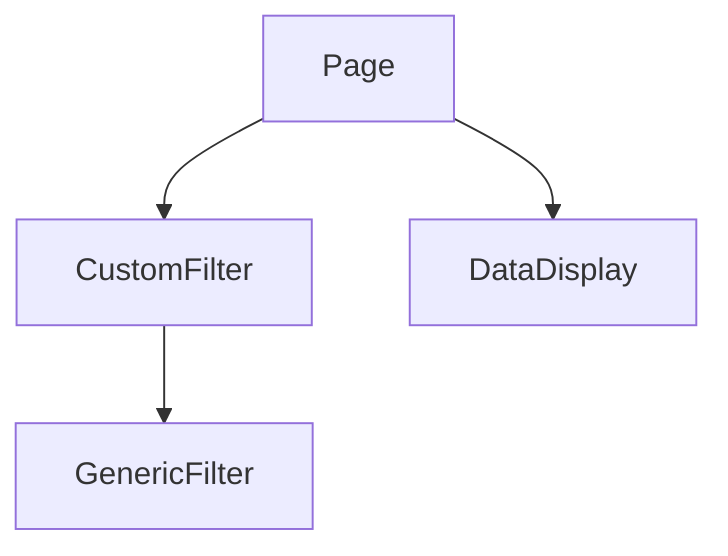
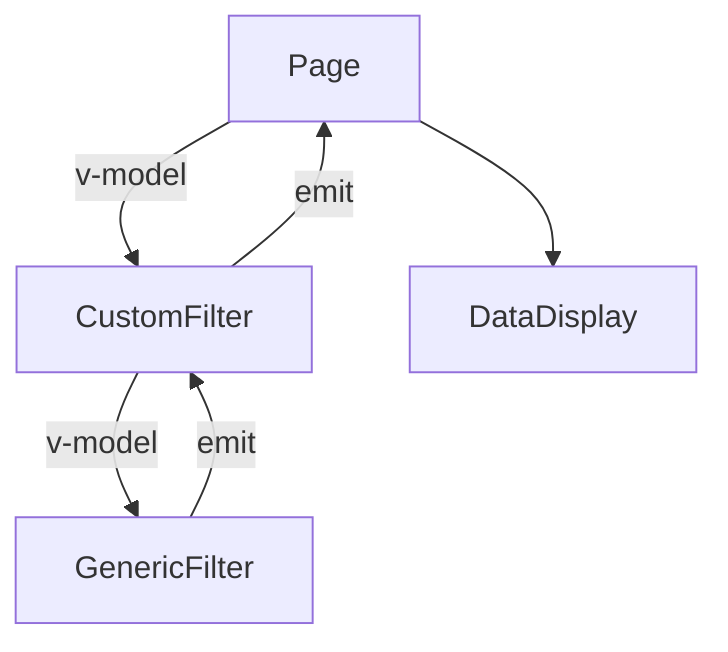

## Background
The article addresses the common case of event handling and management.

Let's look at this simple component tree:  
  


Where `CustomFilter` is a wrapped component that encapsulates the UI logic and styles together. While `DataDisplay` is a component displaying the data that being controlled with the filter.

Let's say the options of the filter can be "name" or "date". That `state` exists in the `GenericFilter` component.

But the `data` that being filtered exists in the `Page` component. 

In React, this is often solved by props-lifting and event callback. We can just pass the callback along the component tree, or provide it with context.

```js
// Page.tsx
export const Page = () => {
    const [ filterOption, setFilterOption ] = useState()
    return (
        <>
            <DataDisplay data={ filtered(data, filterOption) }  />
            <CustomFilter onChange={(e) => setFilterOption(...)} />
        </>
    )
    
}
```
But in vue, we can't pass event handlers as props, in fact we need to handle `props`, `attrs`, `slots` and events separately. And they are just all "props" in React. It is much harder to construct higher order template (HOC) in vue because of this, there is too many things needed to pass through down the tree.

In vue 3.4, `defineModel` was released to lighter the work from defining `v-model` aka `modelValue`. which works like:

```js
// setup
const modelValue = defineModel<string>({
    default: ...,
    local: true,
})
// template
<input v-model="modelValue" />
```

Apply to our case, which will construct a two-way binding tree like:



And this is a nightmare to test and debug. And it will only get worser over time. Imagine with time grows, you may have more and more filters, and you may want to add a `FilterGroup` to gather them, so now you face a 3-layers two-way binding tree, WTF.

